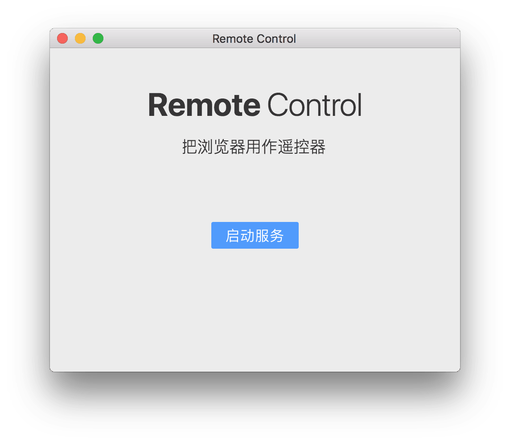
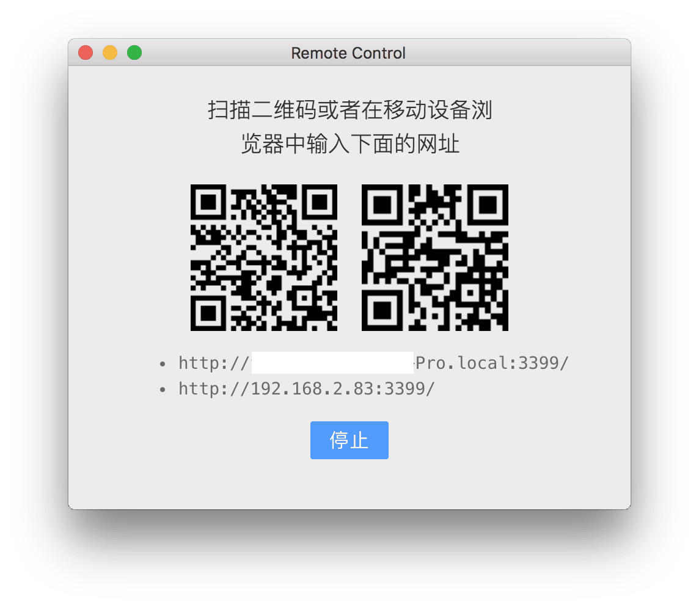

# Remote Control

Remote control PC/Mac/Linux by web browser, No image.

## To Use

Download from release page: https://github.com/yantze/remote-control/releases

For chinese user: http://remote.qingrizhi.com

## To Install

```
git clone https://github.com/yantze/remote-control

cd remote-control
npm i

npm run rebuild

npm run dev
```

## ScreenShot

App ready:


App turn on:

